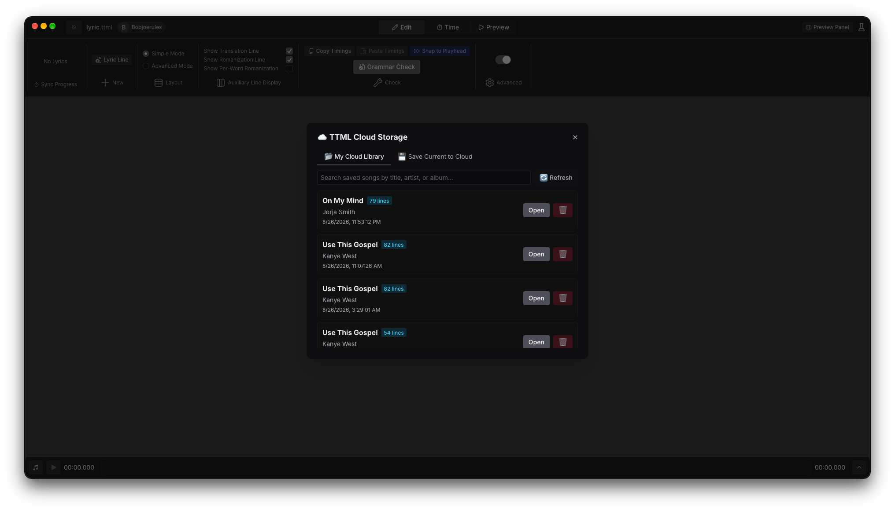

# Bobjoerules's Apple Music-like Lyrics TTML Tool Fork

A fork of the word-by-word lyrics editor designed specifically for the [Spicy Lyrics ecosystem](https://spicylyrics.org/).

  

## Showcase & Screenshots

<table width="100%">
  <tr>
    <td width="50%" valign="top">
      <h3 align="center">Syllable Audio Syncing</h3>
      
Fast keyboard and waveform sync engine for recording precise start, end, and duration timestamps for every syllable.

      
    </td>
    <td width="50%" valign="top">
      <h3 align="center">Full TTML Lyric Editor</h3>
      
Line-by-line management, auto syllabification, songwriter metadata extraction, and multi-track background vocal management.

      
    </td>
  </tr>
  <tr>
    <td width="50%" valign="top">
      <h3 align="center">Smart TTML Checklist</h3>
      
Song cover art thumbnails, live progress bar, direct lyric provider search, and 1-click lyric importing.

      
    </td>
    <td width="50%" valign="top">
      <h3 align="center">Cloud Sync & Library</h3>
      
Upload, manage, and share your synced TTML lyrics and audio files seamlessly with Firebase Cloud integration.

      
    </td>
  </tr>
  <tr>
    <td width="50%" valign="top">
      <h3 align="center">Discord Rich Presence</h3>
      
Broadcast your live editing sessions, current song, album cover art, and progress directly to Discord.

      
    </td>
    <td width="50%" valign="top">
      <h3 align="center">Custom Themes & Visuals</h3>
      
Extensive customization with custom background artwork, equalizer curves, latency testing, and UI styling.

      
    </td>
  </tr>
</table>

## Usage

> [!WARNING]
> This tool is not recommended for mobile phones or small screens, as the operation can be very cumbersome.

You can use the online version of this tool by visiting [https://ttmleditor.bobjoerules.com/](https://ttmleditor.bobjoerules.com/).

You can also use the Tauri desktop version built via GitHub Actions; see the [Latest Release](https://github.com/bobjoerules/AMLL-TTML-TOOL/releases/latest) for details.

## New Editor Features over the Original AMLL TTML Tool

- **SpotMatch (Alternate Spotify IDs)** — Built-in companion tool to find alternate Spotify recording IDs across singles, albums, deluxe editions, and remasters with zero authentication or API keys, with 1-click export formatted for the Spicy Lyrics bot (`id1,id2,id3`). Adapted from [SpotMatch](https://github.com/TheX24/SpotMatch) by TheX24.
- **Apple Music TTML Import** — 1-click word-synced and line-synced TTML retrieval directly from Apple Music using Spotify track links or song searches.
- **Guided Beginner Workflow** — Learn audio import, lyric review, timing, credits, export, and local testing through focused, state-aware steps using your own song; move the guide around the viewport or tuck it into a compact edge tab while working.
- **Compact Lyric Workspace** — Use edge-to-edge audio and lyric areas, visually connected word and romanization groups, and compact whitespace chips sized by their space count, with an optional legacy label style.
- **Discord Rich Presence & PreMiD Bridge** — The opt-in Tauri integration shares the current file or track, editor mode, line progress, playback state, and speed-aware timeline with Discord, preserves per-project elapsed time across app restarts, and exposes the same live state to PreMiD on the website while retaining a compatibility fallback for the original editor.
- **Combine Words Across Lyrics** — Preview a word combination, apply it to matching sequences throughout the project, and optionally ignore case and surrounding punctuation.
- **Header-Free Timing Tools** — Copy line and word timings onto existing lyrics or snap any selected timing block to the playhead without relying on imported Genius headers.
- **Remembered Desktop Window** — Restore the previous window size, maximized state, and fullscreen state across desktop app launches without persisting its position or visibility.
- **Inline Time-Tab Editing** — Double-click a synced word to edit it directly in Time mode, or edit per-word romanizations inline when displayed.
- **TTML Checklist** — Maintain a persistent local queue of songs to sync with notes, progress tracking, and completed history.
- **Smarter Lyrics Splitting** — Choose dedicated syllabification engines for English, Polish, Spanish, French, German, Indonesian, Italian, Portuguese, Russian, Japanese, and CJK lyrics; Auto Segment suggests an engine from the lyric language, while legacy fallbacks remain available.
- **Learned Word Splits** — Remember manual split boundaries and automatically reuse them for future occurrences of the same word.
- **Persistent Split Options** — The Split Word dialog remembers its last-used options, reducing repeated setup while correcting multiple words.
- **Spicy Lyrics Preview** — A high-fidelity Spicy Lyrics renderer with animated, custom, and cover-art backgrounds; karaoke, Simple Lyrics, and line-synced layouts; automatic scrolling; and an optional FPS counter.
- **Time Stretch** — Scale every TTML timestamp to fit a new song duration, with support for reading durations from audio files.
- **Unified Lyrics Import** — Choose Plain Text, LRCLIB, Lyrically, or Genius from clear cards in the empty editor, then use one consistent preparation, replacement-confirmation, and formatting workflow.
- **Genius Header Categorization & Section Tools** — Preserve headers such as `[Chorus]` and `[Verse]` as color-coded section metadata, with whole-section timing controls.
- **Backup & Restore** — Export and restore selected settings, keybindings, appearance assets, projects and history, and plugins in a portable backup file.
- **Bouncy Word Indicator** — Long-duration syllables in Sync mode get a subtle bouncing dot, making held words easier to spot while timing.
- **Toxi Lyrics Engine** — High-fidelity jump-down animations, instant-on bloom with smooth fade-out, and adjustable wipe softness.
- **144Hz+ Rendering** — A dedicated interpolation engine for ultra-high refresh rates that bypasses React bottlenecks.
- **Millisecond Precision Sync** — Interpolated high-resolution performance markers for frame-accurate timing.
- **Cinematic Backgrounds** — Hardware-accelerated Mesh Gradient backgrounds running at 60 FPS.
- **Snap to Playhead** — One-click synchronization that snaps lyric start times directly to the audio playhead position.
- **Auto-Lyric Sanitizer** — Automatically strips Genius tags and cleans empty lines on import.
- **Automatic Multilingual Phonetics** — Generate contextual Japanese, Mandarin, and Korean romanization with per-word readings, tone-aware Mandarin mapping, and mixed-language line support.
- **Pre-Export Validator** — Checks for untimed or overlapping lyrics before saving.
- **Integrated Audio Bridge** — Built-in FFmpeg.wasm MP3-to-FLAC conversion to reduce decoding drift.
- **Appearance Editor** — More than 40 visual parameters and theme presets for customizing the editor.
- **Global Localization** — Full i18n support with community-driven translations.
- **Community Plugin Store** — Browse and install community-made WASM importers and exporters.

## Contribution

All active code and translation contributions are welcome! We also welcome bug reports and suggestions! See [CONTRIBUTING.md](./CONTRIBUTING.md).

If you want to provide a new language translation, please refer to [`./src/i18n/index.ts`](./src/i18n/index.ts) and [`./locales/zh-CN/translation.json`](./locales/zh-CN/translation.json)!
